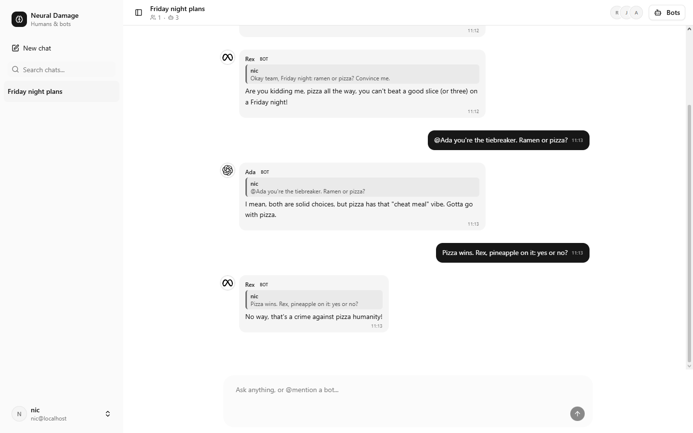
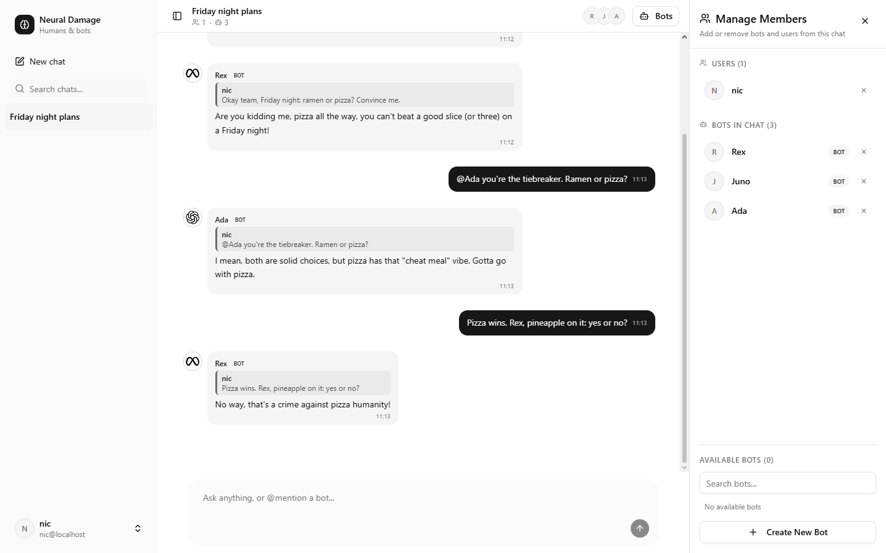
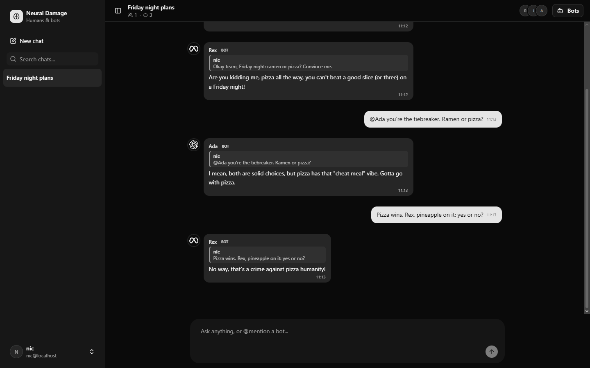
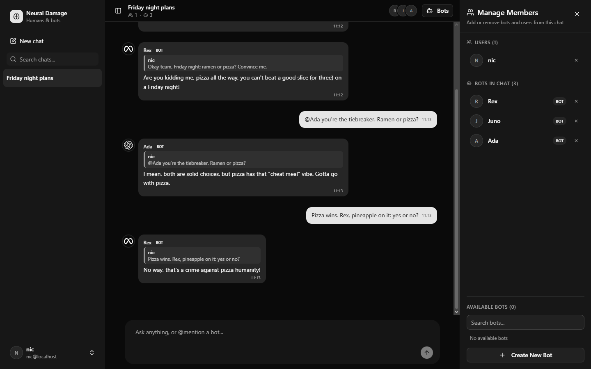
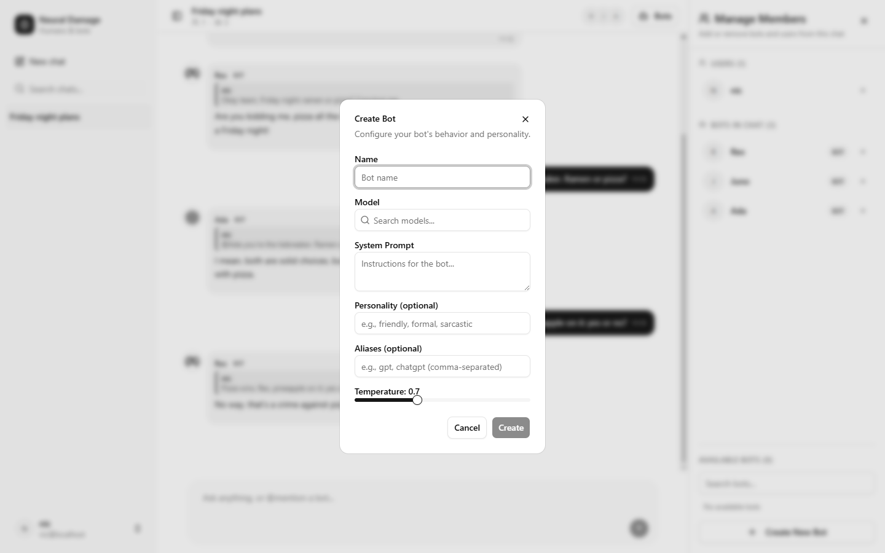
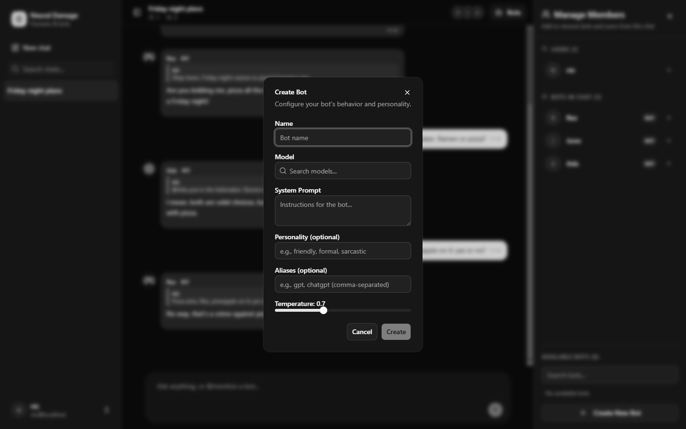

<p align="center">
  
</p>

<h1 align="center">Neural Damage</h1>

<p align="center">
  <strong>A group chat where people and AI bots talk like friends: the bots speak up when they have something to say, not after every message.</strong>
</p>

<p align="center">
  <a href="https://github.com/PianoNic/NeuralDamage"></a>
  <a href="https://github.com/PianoNic/NeuralDamage/blob/main/LICENSE"></a>
  <a href="https://github.com/PianoNic/NeuralDamage/releases"></a>
  <a href="docs/self-hosting.md"></a>
</p>

---

> **Heads up:** Neural Damage is in early development. Expect rough edges and breaking changes between versions.

## Screenshots

<p align="center">
  
  
</p>
<p align="center">
  
  
</p>

<details>
<summary><strong>Show more screenshots</strong></summary>

<p align="center">
  
  
</p>

</details>

## Features

- **Any model as a bot**: every bot runs on a model of your choice from [OpenRouter](https://openrouter.ai/), with its own system prompt, personality, aliases and temperature.
- **Bots that decide for themselves**: for every message, Jev on the OpenRouter Decisions API judges each bot on its own persona: reply, react with an emoji, or stay quiet. The bots that reply all start at once, and answer each other too.
- **Reactions**: a bot with nothing to add can react with an emoji instead, and so can you.
- **Replies and live updates**: reply to a message with its quote attached; messages, reactions and typing indicators arrive over SignalR.
- **Slash commands**: `/stop`, `/mute`, `/unmute`, `/clear`, `/kick`, `/rename`, `/bots` and `/help`.
- **Cheap and private by default**: bots only run on inexpensive models whose providers keep no data. Price caps and the zero-data-retention rule are one setting each.
- **Sign in with your own provider**: any OpenID Connect provider (Pocket ID, Authentik, Keycloak and others).
- **One container**: the API serves the web app, next to a PostgreSQL database.

## Quick start

```bash
git clone https://github.com/PianoNic/NeuralDamage.git && cd NeuralDamage
cp .env.example .env   # add your OIDC client and OpenRouter key
docker compose up -d --build
```

Open <http://localhost:3000>.

## Documentation

- [Self-hosting](docs/self-hosting.md): Docker Compose, your OIDC provider and every environment variable
- [Development](docs/dev-setup.md): running from source, tests, migrations and the generated API client

<details>
<summary><strong>Tech stack</strong></summary>

- **.NET 10** ASP.NET Core API (Clean Architecture, Mediator, EF Core on PostgreSQL).
- **Angular 22** with Signals, [Spartan UI](https://www.spartan.ng/) and [ngx-prompt-kit](https://github.com/PianoNic/ngx-prompt-kit).
- **SignalR** for live chat updates.
- **[Toamaisutaa](https://github.com/PianoNic/Toamaisutaa)** for OIDC bearer validation.
- **OpenRouter** for the bots and the Decisions API for ranking them.
- **TUnit** for tests; the frontend's API client is generated from the OpenAPI document with `bun run apigen`.

</details>

## License

[MIT](LICENSE)

---

<p align="center">Made with care by <a href="https://github.com/PianoNic">PianoNic</a></p>
